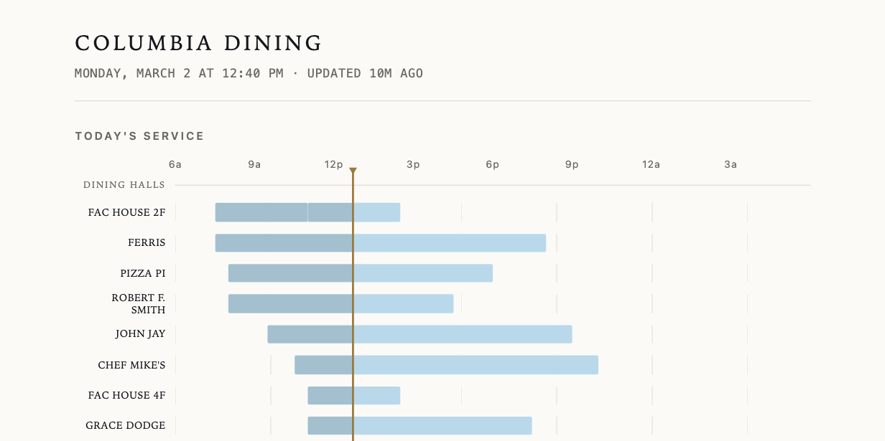

# Columbia Dining

**[whddnjs1124.github.io/CU_Dining](https://whddnjs1124.github.io/CU_Dining/)**

Every Columbia dining hall and café on one page: who's serving right now, until
when, and what's on today. Built because answering "where can I eat?" meant
opening four pages on dining.columbia.edu.

Unofficial, and not affiliated with Columbia University.



## How it works

A GitHub Action scrapes `dining.columbia.edu` every 30 minutes and commits a
static `dining.json`. The page is one HTML file that reads it. No server, no
database, no build step, no dependencies — it deploys as two files on GitHub
Pages and costs nothing to run.

Two things shaped the design:

**The site is behind a Cloudflare JS challenge.** `curl`, `requests`, and
server-side `fetch` all get `403 Just a moment...`, so the scraper drives a
real headless browser. There is no lighter option.

**But it also ships its whole dataset inline.** Every dining page carries
`dining_nodes`, `dining_terms`, and `menu_data` as JS globals — the same JSON
its own AngularJS app consumes. So one page load is the entire scrape, and no
HTML parsing is involved, which means a CSS change on Columbia's side can't
break it.

Open/closed is computed in your browser rather than baked into the JSON, so the
status stays right even when the snapshot is half an hour old. The logic is a
deliberate port of Columbia's own `getOpenStatus()` — same integer clock
arithmetic, same overnight wraparound — so this page never contradicts the
official one. The one intentional difference: it uses New York time instead of
your device's clock.

## Running it locally

```bash
python -m venv .venv && .venv/bin/pip install -r requirements.txt
.venv/bin/playwright install chromium

.venv/bin/python scrape.py          # refresh dining.json
.venv/bin/python -m http.server 8000  # then open localhost:8000
```

Useful while developing:

- `?now=2026-03-02T12:40:00-05:00` — override the clock. Essential over breaks,
  when everything is closed and no status ever changes.
- `?selftest` — run the in-page assertions in your browser.
- `python scrape.py --recon <url>` — dump every network response a page makes
  and save its rendered HTML, for when Columbia changes something.

## Tests

```bash
.venv/bin/python -m pytest
```

Two layers, both aimed at one job: noticing when Columbia changes something and
this page starts quietly showing nothing.

- `test_scrape.py` — the parser, against the last captured payload.
- `test_frontend.py` — drives the real page in a headless browser, including
  the in-page assertion suite, so CI catches frontend regressions too.

## Known limits

- **Menus are unverified.** `menu_data` is empty over summer break; the first
  Fall node is dated 2026-09-04. The rendering path is tested against a
  synthetic payload, but the field names inside a dish were reverse-engineered
  from Columbia's filter code and could be wrong. See `build_item()`.
- Columbia's own data occasionally contradicts itself — one café's prose hours
  say 3 p.m. while its structured hours say 14:00. This page trusts the
  structured hours and doesn't print the prose.
- Hours and menus can change without notice. Check
  [dining.columbia.edu](https://dining.columbia.edu) before you walk over.

## More

- [`docs/PRD.md`](docs/PRD.md) — what this is for, and what was left out.
- [`docs/HLD.md`](docs/HLD.md) — architecture, data schema, design, failure modes.
