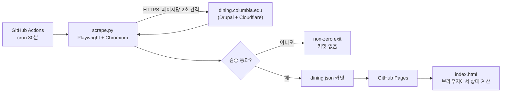

# HLD — Columbia Dining 대시보드

요구사항은 `docs/PRD.md`. 이 문서는 "어떻게"와 "깨지면 어떻게 되는가"를 다룬다.

## 아키텍처



서버도 DB도 API도 없다. 산출물은 정적 파일 2개(`index.html`, `dining.json`)이고 GitHub Pages가 CDN에서 서빙한다. 사용자 트래픽은 컬럼비아 쪽에 전혀 닿지 않는다 — Cloudflare를 상대하는 건 30분에 한 번 도는 Actions 러너뿐이다.

## 왜 헤드리스 브라우저인가 (협상 불가)

dining.columbia.edu는 Cloudflare JS 챌린지 뒤에 있다. 조사 결과:

| 접근 | 결과 |
|---|---|
| `curl` (기본) | 403 `Just a moment...` |
| `curl` + 브라우저 UA + 전체 헤더 | 403 (TLS 지문으로 걸림) |
| 서버 사이드 fetch / `requests` | 403 |
| `/jsonapi`, `/sitemap.xml` 등 직접 호출 | 403 |
| 브라우저 기반 프록시 (JS 실행) | **200, 정상 렌더** |
| `robots.txt` | 200 (Cloudflare 예외) |

즉 **JS를 실행하는 실제 브라우저 엔진만 통과한다.** 스크레이퍼를 "가볍게" 만들겠다고 HTTP 클라이언트로 교체하려는 시도는 반드시 실패한다. 이건 최적화 여지가 아니라 제약이다.

부수 효과로 하나 얻는 것도 있다: 메뉴/영업여부가 Drupal Views AJAX 위젯(`/#/cu_dining_open_now-260`)으로 클라이언트에서 렌더링되는데, 브라우저를 쓰면 렌더 완료 후 DOM을 읽거나 `page.on("response")`로 AJAX 응답 JSON을 가로챌 수 있다.

## 데이터 소스 — DOM을 파싱하지 않는다

정찰(`scrape.py --recon`) 결과, 페이지는 AngularJS 앱이고 데이터는 **모든 dining 페이지에 인라인 JS 전역변수로 통째로 실려 있다:**

| 전역변수 | 내용 |
|---|---|
| `dining_nodes` | 로케이션 16곳. 이름, 경로, 좌표, `crowd_id`, `open_hours_fields` |
| `dining_terms` | 분류 사전 4종: `types`(끼니), `stations`, `dietary_prefs`, `ingredients` |
| `menu_data` | 향후 7일치 메뉴 **전체** — 모든 로케이션 통합 |
| `window.timezoneOffset` | `-14400` (EDT). 날짜 필드 해석에 필요 |

앱 자신이 `$scope.menus = JSON.parse(menu_data)`로 통째로 받아 클라이언트에서 `menuByLocation` 필터로 쪼갠다. 따라서 **한 페이지 로드가 전체 스크레이프다.** 16번 순회할 필요가 없고, 컬럼비아 서버 부담은 30분당 요청 1건이다.

이 경로를 고른 이유: 이건 그들의 앱이 실제로 먹는 JSON이라, CSS 클래스나 템플릿 마크업이 바뀌어도 안 깨진다. HTML 파싱보다 한 단계 아래 지층이다.

부수적으로 계획보다 많이 얻었다: **알레르겐**과 **식이 선호(비건/할랄/글루텐프리)**가 항목 단위로 들어있고, 5개 로케이션(John Jay, Ferris, JJ's, Chef Mike's, Uris)은 `crowd_id`로 `/cu_dining/rest/occuspace_locations/<id>` 실시간 혼잡도를 노출한다.

### 영업 상태 로직

`index.html`의 `statusOf()`는 사이트 JS의 `getOpenStatus()`를 **의도적으로 그대로** 포팅한 것이다:

- 시각을 `HHMM` 정수로 비교 (`1930`)
- 심야 영업(JJ's Place 정오→익일 10시)은 `hours_from >= hours_to`일 때 `±2400` 랩어라운드
- 마감/개점 1시간 전 = `Closes Soon` / `Opens Soon`
- `date_from`~`date_to` 학기 블록 + `excluded` 공휴일 배열

동일하게 유지하는 게 요점이다. 공식 사이트와 답이 갈리면 신뢰를 잃는다. 딱 한 군데만 다르다: 그쪽은 브라우저 로컬 시각을 쓰는데(여행 중인 사용자에게 틀림), 우리는 항상 `America/New_York`로 계산한다.

날짜 필드(`2026-01-20T05:00:00`)는 UTC로 저장되어 있다. 앱은 `timezoneOffset`을 더해 로컬로 옮기는 우회를 쓰지만, 우리는 UTC로 파싱해 절대 시각으로 비교한다 — 보는 사람의 기기 시간대와 무관하게 옳다.

## `dining.json` 스키마

```json
{
  "updated_at": "2026-08-08T13:43:33-04:00",
  "timezone_offset": -14400,
  "locations": [
    {
      "nid": "840",
      "name": "John Jay Dining Hall",
      "type": "dining_hall",
      "url": "https://dining.columbia.edu/content/john-jay-dining-hall",
      "description": "<p>…</p>",
      "crowd_id": "840",
      "open_hours_fields": [
        {
          "date_from": "2026-05-18T04:00:00",
          "date_to":   "2026-08-25T04:00:00",
          "days": [{ "days_monday": [{ "hours_from": "0800", "hours_to": "1400" }] }],
          "displayed_hours": [{ "title": "Closed for Summer" }],
          "excluded": ["2026-03-16"]
        }
      ]
    }
  ],
  "menus": [
    {
      "location_nids": ["840"],
      "date_from": "2026-10-29T05:00:00",
      "date_to":   "2026-10-29T10:59:00",
      "meal": "Breakfast",
      "stations": [
        { "name": "Main Line",
          "items": [{ "title": "Scrambled Eggs",
                      "allergens": ["Eggs"],
                      "dietary": ["Gluten Free", "Halal", "Vegetarian"] }] }
      ]
    }
  ]
}
```

| 필드 | 비고 |
|---|---|
| `updated_at` | ISO 8601, America/New_York 오프셋 포함. 프론트의 신선도 배너 근거. |
| `nid` | 컬럼비아의 Drupal 노드 ID. 안정적인 키이고 `menus`의 조인 키. |
| `type` | `dining_hall` \| `retail`. 로케이션 이름으로 판정 (`scrape.py`의 `DINING_HALLS`). |
| `crowd_id` | 있으면 실시간 혼잡도 조회 가능. 5곳만 보유. v1 미사용. |
| `open_hours_fields` | **원본 그대로 통과시킨다.** 학기 블록 + 요일별 `HHMM` + 사람용 문구 + 공휴일 제외. |
| `menus` | 로케이션별이 아니라 최상위 평면 리스트. 한 메뉴가 여러 로케이션에 걸릴 수 있어서. |

**설계 결정 세 가지:**

**`open_hours_fields`를 정규화하지 않고 그대로 넘긴다.** 처음엔 날짜별 평면 리스트로 펴려고 했는데, 원본 모델이 이미 정확히 옳다 — 학기 날짜 범위, 요일별 시간, 공휴일 제외 배열. 다시 쓰는 건 순수한 손실이다.

**상태 문자열("Open", "closes 8 PM")은 JSON에 없다.** 시간대만 담고 프론트가 계산한다. JSON이 30분 stale해도 상태 표시는 현재 시각 기준으로 정확해야 하니까.

**혼잡도는 v1에서 뺐다.** 데이터는 공짜로 있지만 실시간이라 30분마다 굽는 JSON에 넣으면 무의미하고, 정적 페이지에서 직접 호출하면 CORS에 막힌다. 의미 있게 하려면 프록시가 필요 = 서버 = 아키텍처 변경.

## 디자인

**해시계(sundial).** Low Plaza의 해시계에서 가져왔고, 이 앱의 본질이 "시간"이라서 골랐다. 히어로는 오전 6시~새벽 2시 리본이고 식당 하나가 한 행, 영업 시간대가 Columbia Blue 막대다. 황동 세로선이 지금을 관통하고, **이미 지나간 시간에는 그림자가 진다** — 남은 밝은 파랑의 길이가 곧 "아직 먹을 수 있는 시간"이다. 대담한 요소를 여기 하나에만 쓰고 나머지는 조용하게 뒀다.

**다이닝홀과 카페는 구분한다.** 리본 안에서는 시간축을 하나로 유지한 채 거터에 그룹 라벨 + 괘선으로 나누고(축을 둘로 쪼개면 하루를 읽기 어려워진다), 카드 목록은 두 섹션으로 나눈다.

**왕관 마크는 없다.** King's Crown을 직접 그려 마스트헤드에 넣어봤지만 빼는 쪽이 나았다 — 각인 대문자 워드마크와 황동 NOW 마커만으로 이미 컬럼비아로 읽히고, 왕관은 거기에 얹힌 세 번째 목소리였다. 다시 넣고 싶어지면 먼저 무엇을 뺄지부터 정할 것.

팔레트는 컬럼비아의 실제 재료에서 왔다. 흔한 대학 네이비가 아니라 **Pantone 290 Columbia Blue `#B9D9EB`** (창백한 게 핵심), McKim의 인디애나 석회암 `#fbfaf7`, 괘선 `#e4e0d6`, 딥블루 `#005587`. **황동 `#9a7b3f`는 NOW 마커 전용** — 페이지에서 유일한 따뜻한 색이라 눈이 바로 간다. 왕관은 마스트헤드에 딱 한 번(인라인 SVG). NOW선에도 넣으면 과했다.

타입은 시스템 폰트만: 각인 느낌의 대문자에 `Iowan Old Style`/Georgia, 본문에 system-ui, 모든 시각에 `ui-monospace` + `tabular-nums`(시간 앱이니 숫자가 흔들리면 안 된다). 외부 요청 0, 즉시 렌더 — 10초짜리 유틸리티엔 이게 맞다.

리본에서 지킬 것 두 가지:
- **`shortName()`이 이름을 두 줄 안에 넣지 못하면 막대 정렬이 깨진다.** 행 높이가 고정(`min-height: 1.9rem`)이라 세 줄짜리 이름은 차트를 흔든다. 이름 규칙을 바꾸면 셀프테스트의 `shortNames` 표도 같이 갱신할 것.
- **방학으로 닫힌 곳은 리본에서 빼고 배너 한 줄로 요약한다.** 빈 트랙 11개는 정보가 아니라 소음이다.

## 프론트엔드

`index.html` 한 파일. 프레임워크·번들러·CDN 스크립트·웹폰트 없음.

- `fetch('dining.json')` → 렌더.
- 뉴욕 현재 시각은 `Intl.DateTimeFormat(..., { timeZone: 'America/New_York' })`. DST를 브라우저가 처리하므로 날짜 라이브러리 불필요.
- 상태 5종 `open` / `closing`(1시간 내 마감) / `opening`(1시간 내 개점) / `closed` / `break`, 이 순서로 정렬.
- 카드: 이름 / 상태 pill / 실제 시각("Open until 9:00 PM") / `<details>`로 접은 오늘 메뉴.
- **사이트의 산문형 시간 안내(`displayed_hours`)는 계산 가능한 시간대가 있으면 표시하지 않는다.** 컬럼비아 데이터가 자기모순인 경우가 있어서 — Everett은 산문에 "8 a.m. - 3 p.m."인데 구조화 데이터는 14:00이다. 둘 다 보여주면 이 페이지가 틀린 것처럼 보인다. 상태를 뽑아낸 것과 같은 숫자로 오늘 시간대를 직접 출력하고, 산문은 계산할 게 아무것도 없을 때만 남긴다.
- 상단: "updated N분 ago". `updated_at`이 6시간 이상 지났으면 경고 배너.
- 다크모드는 `prefers-color-scheme` + `data-theme` 오버라이드.
- `?now=2026-08-10T12:00:00-04:00` 쿼리로 현재 시각 오버라이드.
- `?selftest` — 상태 로직 어서션 13개를 페이지에서 실행. 개점/마감임박/개점임박/마감, 심야 랩어라운드 3종, 공휴일 제외, 비활성 학기 블록, 시각 포맷.

## 실패 모드

이 프로젝트의 진짜 리스크는 다운타임이 아니라 **조용히 틀린 메뉴를 보여주는 것**이다. 배고픈 사람을 닫힌 식당으로 보내는 게 "정보 없음"보다 나쁘다.

| 상황 | 시스템 동작 | 사용자에게 보이는 것 |
|---|---|---|
| Cloudflare 차단 / 네트워크 실패 | 예외 → non-zero exit, 커밋 없음 | 이전 데이터 + "N시간 전 업데이트" (6h 초과 시 경고 배너) |
| 마크업 변경으로 파서 깨짐 | 로케이션 수가 이전보다 적음 → 검증 실패 → 커밋 없음 | 위와 동일. Actions는 실패로 표시되어 알림이 옴 |
| 일부 식당 페이지만 실패 | **부분 결과를 쓰지 않는다.** 전체 실패 처리 | 위와 동일 |
| cron 지연 (Actions 부하) | 다음 실행에서 정상 반영 | 최대 20분 추가 지연. 무해 |
| 60일 무활동으로 스케줄 자동 비활성화 | 스크레이퍼 자신의 커밋이 활동으로 집계되어 자가 유지 | 해당 없음 |
| JSON은 신선한데 원본이 틀림 | 감지 불가 | 카드에서 원본 페이지로 링크 |

핵심 불변식: **부분 결과는 절대 커밋하지 않는다.** 조금 오래된 정확한 데이터 > 방금 만든 반쪽 데이터.

## 테스트

두 겹, 둘 다 목적은 커버리지가 아니라 **회귀 감지 하나**다: 컬럼비아가 뭔가 바꿔서 파이프라인이 조용히 빈 결과를 내기 시작하는 순간을 잡는 것.

- **`pytest`** — `fixtures/globals.json`(방금 캡처한 실제 페이로드)을 `build()`에 먹여 16곳 생존, HTML 엔티티 언이스케이프, 전 로케이션 시간 보유, 부분 스크레이프 거부를 assert. 메뉴 경로는 여름엔 `menu_data`가 비어 있어 합성 페이로드로 검증한다.
- **`index.html?selftest`** — 상태 계산 어서션 13개. 브라우저에서 그대로 돈다.

CI는 스크레이프 **직후** `pytest`를 돌린다. 갓 받은 페이로드를 검증하는 것이라, 마크업이 바뀌면 커밋 전에 잡힌다.

### 아직 검증 못 한 것

**메뉴 렌더링.** 여름방학이라 `menu_data`가 `[]`다 — 다이닝홀 전부 `Closed for Summer`이고 첫 Fall 메뉴 노드는 **2026-09-04**자다. 끼니 항목 단위의 필드명(`title` 외 알레르겐/식이선호)은 앱 JS의 필터 구현에서 역산한 것이라 실물과 다를 수 있다. `scrape.py`의 `build_item()`에 `ponytail:` 코멘트로 표시했고, 방어적으로 작성해서 예상 밖 키에도 죽지 않는다. **9월 4일에 실물 확인 필요.**

## 운영

- **크롤 예의**: 전체 스크레이프가 페이지 로드 1건이라 30분 주기로도 하루 48요청뿐이다. `robots.txt` 준수(`/content/*` 허용됨).
- **배포**: `main` 브랜치 루트를 GitHub Pages로 서빙. 빌드 스텝 없음.
- **모니터링**: Actions 실패 알림 = 유일한 모니터링. 별도 도구 불필요.
- **비용**: $0 (퍼블릭 리포는 Actions 무료).

## 확장 여지

지금 하지 않지만 아키텍처가 막지 않는 것들:

- **즐겨찾기** — localStorage, 프론트만 수정.
- **주간 메뉴** — `menu_data`가 이미 7일치를 통째로 준다. `dining.json`에도 다 들어있으니 프론트에 날짜 선택기만 붙이면 됨. 스크레이퍼 수정 불필요.
- **알레르겐 / 식이 필터** — 데이터가 이미 항목 단위로 들어있다. 프론트 필터 UI만.
- **실시간 혼잡도** — `crowd_id` 5곳. CORS 우회 프록시가 필요 = 서버.
- **알림** — 서버가 필요해진다. 아키텍처가 바뀌는 유일한 항목.
